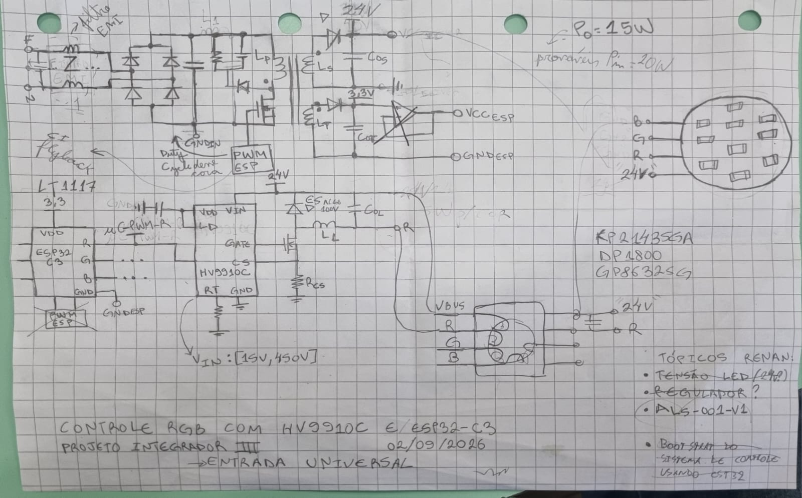

# Bralight Controladora led

## Objetivo:

Aqui é onde se registra o firmware da luminaria bralight

## Imagens do Circuito:

## Links:

- [Multi-String RGBW LED Driver Based on a Single-Input Multiple-Output Topology](https://ieeexplore.ieee.org/abstract/document/11197970)

- [Statistical Analysis of Current Mismatch in Light Emitting Diode Strings](https://ieeexplore.ieee.org/abstract/document/10406713)
